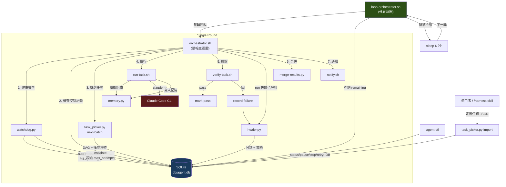
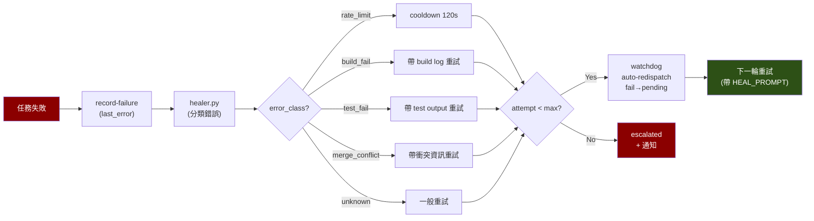

# Agent Harness

> 基於 Claude Code CLI 的自主多 Agent 編排系統
> 自動迴圈 + DAG 排程 + 並行執行 + 自我修復 + 智慧冷卻 + 監控控制

## 設計理念

- **完全自主運作** — `loop-orchestrator.sh` 持續跑直到所有任務完成，無需人工介入
- **每輪乾淨 session** — 每次用 `claude -p` 啟動全新 context，不受 context window 壓縮影響
- **記憶外化** — 所有狀態保存在 SQLite，Claude 是無狀態的執行器
- **驗證不信自報** — 永遠用客觀指令（test / build / lint）判斷結果
- **自我修復** — 失敗自動分類錯誤、注入修復 context、帶上下文重試
- **智慧冷卻** — 根據錯誤類型自動調整等待時間（rate limit → 120s，一般失敗 → 30s，無失敗 → 5s）
- **安全保險絲** — max-rounds / max-time 防止無限空轉
- **可中斷可恢復** — 任何時候 pause/stop，恢復後從斷點繼續
- **衝突隔離** — git worktree 讓並行 worker 互不干擾

> **前提**：使用 Claude Max 訂閱方案，無 API 費用問題。

## 快速開始

### 在 Claude Code 中安裝（最簡單）

如果你已經有 `/install-harness` skill，直接在 Claude Code 裡輸入：
```
/install-harness
```

### 首次安裝

```bash
# 一鍵安裝（推薦）
curl -sSL https://raw.githubusercontent.com/Muheng1992/agent-harness/main/install.sh | bash

# 或本地安裝
bash install.sh
# 或手動初始化
make init

# 2. 建立任務
make import-tasks DIR=tasks/my-project

# 3. 自動跑到全部完成（推薦）
bash loop-orchestrator.sh

# 4. 並行模式
bash loop-orchestrator.sh --parallel

# 5. 查看狀態
agent-ctl status
```

## 架構總覽



## 執行模式

### 自動迴圈（推薦）

```bash
# 單執行緒，跑到 DAG 全部完成
bash loop-orchestrator.sh

# 並行模式
bash loop-orchestrator.sh --parallel

# 自訂安全限制
bash loop-orchestrator.sh --max-rounds 100 --max-time 43200
```

| 參數 | 預設值 | 說明 |
|------|--------|------|
| `--parallel` | off | 使用 parallel-orchestrator.sh（多 worker） |
| `--max-rounds` | 500 | 最大迴圈輪數 |
| `--max-time` | 86400 (24h) | 最大執行時間（秒） |

### 單輪執行

```bash
bash orchestrator.sh              # 一次一個任務
bash parallel-orchestrator.sh     # 一次多個任務
```

### Makefile 捷徑

```bash
make run-loop              # = bash loop-orchestrator.sh
make run-loop-parallel     # = bash loop-orchestrator.sh --parallel
make run-once              # = bash orchestrator.sh
make run-parallel          # = bash parallel-orchestrator.sh
```

## 任務定義

在 `tasks/{project}/` 目錄下建立 JSON 檔案：

```json
{
  "id": "implement-login-api",
  "project": "my-web-app",
  "project_dir": "/absolute/path/to/project",
  "goal": "實作 POST /api/auth/login endpoint...",
  "touches": ["src/routes/auth.ts", "src/middleware/jwt.ts"],
  "verify": "npm test -- --grep 'auth/login'",
  "depends_on": ["setup-user-model"],
  "max_attempts": 5
}
```

| 欄位 | 必填 | 說明 |
|------|------|------|
| `id` | Yes | 唯一識別（全 DB 範圍） |
| `project` | Yes | 所屬專案名稱 |
| `project_dir` | Yes | 目標專案的**絕對路徑**，Worker 會 cd 到這裡執行 |
| `goal` | Yes | 給 Claude 的任務描述（不需寫 cd 指令） |
| `touches` | No | 會修改的檔案（相對於 project_dir），用於並行衝突偵測 |
| `verify` | No | 客觀驗證指令（在 project_dir 下執行） |
| `depends_on` | No | 前置任務 ID 陣列，形成 DAG |
| `max_attempts` | No | 最大重試次數（預設 5） |

## 控制面板 — agent-ctl

```bash
agent-ctl status              # 總覽儀表板
agent-ctl tasks               # 所有任務 DAG
agent-ctl tasks my-project    # 篩選專案
agent-ctl logs task-id        # 執行歷史

agent-ctl pause               # 暫停（下一輪 loop 會停）
agent-ctl resume              # 恢復
agent-ctl stop                # 停止

agent-ctl kill                # 強殺所有 worker
agent-ctl kill 2              # 只殺 Worker 2

agent-ctl skip task-id        # 跳過任務
agent-ctl retry task-id       # 重置任務（attempt_count=0）

agent-ctl plan 'build a REST API' \
  --project my-api -d ~/projects/my-api   # AI 自動拆解任務
```

## 自我修復機制



| 錯誤類型 | 偵測方式 | 修復策略 | 冷卻 |
|---------|---------|---------|------|
| `rate_limit` | "429" / "rate limit" | 等待後重試 | 120s |
| `build_fail` | "build failed" | 帶 build error log 重試 | 0s |
| `test_fail` | "test failed" | 帶 test output 重試 | 0s |
| `merge_conflict` | "merge conflict" | 帶衝突資訊重試 | 0s |
| `unknown` | 其他 | 一般重試 | 0s |
| 多次失敗 | attempt >= 3 | 強制 root cause 分析 | — |
| 超過上限 | attempt >= max | escalate + macOS 通知 | — |

## 檔案結構

```
agent-harness/
├── loop-orchestrator.sh     # 外層自動迴圈（推薦入口）
├── orchestrator.sh          # 單輪主迴圈
├── parallel-orchestrator.sh # 並行單輪迴圈
├── run-task.sh              # 單一任務執行（呼叫 Claude）
├── verify-task.sh           # 任務驗證
├── task_picker.py           # DAG 管理 + 任務挑選
├── healer.py                # 錯誤分類 + 修復策略
├── watchdog.py              # 卡死偵測 + 自動重派
├── memory.py                # 跨 session 記憶
├── merge-results.py         # 合併成功的 worker 分支
├── agent-ctl                # CLI 監控 + 控制工具
├── notify.sh                # macOS 桌面通知
├── setup-worktrees.sh       # 初始化 git worktree
├── schema.sql               # 資料庫 schema
├── install.sh               # 一鍵安裝腳本
├── Makefile                 # 常用操作捷徑
├── db/agent.db              # SQLite 資料庫（自動生成）
├── tasks/                   # 任務定義 JSON
│   └── {project}/
└── .worktrees/              # Git worktree（自動生成）
```

## Claude Code Skill

安裝後可在任何專案目錄使用：

```
/harness 建一個 Express REST API，包含 user CRUD 和認證
```

Skill 會自動：分析專案 → 拆解 DAG → 展示給你確認 → 匯入 → 詢問是否啟動 loop。

## 需求

- macOS（通知使用 osascript）
- Python 3.10+（無外部依賴）
- Claude Code CLI（`claude` 指令）+ Max 訂閱
- SQLite3、jq、Git

## License

MIT
