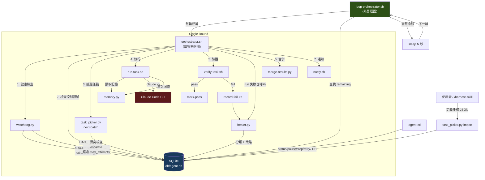
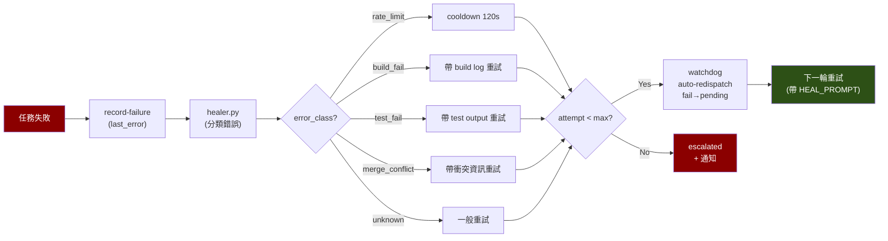

# Agent Harness

> 基於 Claude Code CLI 的自主多 Agent 編排系統
> 自動迴圈 + DAG 排程 + 並行執行 + 自我修復 + 智慧冷卻 + 監控控制

## 設計理念

- **完全自主運作** — `loop-orchestrator.sh` 持續跑直到所有任務完成，無需人工介入
- **每輪乾淨 session** — 每次用 `claude -p` 啟動全新 context，不受 context window 壓縮影響
- **記憶外化** — 所有狀態保存在 SQLite，Claude 是無狀態的執行器
- **驗證不信自報** — 永遠用客觀指令（test / build / lint）判斷結果
- **自我修復** — 失敗自動分類錯誤、注入修復 context、帶上下文重試
- **智慧冷卻** — 根據錯誤類型自動調整等待時間（rate limit → 120s，一般失敗 → 30s，無失敗 → 5s）
- **安全保險絲** — max-rounds / max-time 防止無限空轉
- **可中斷可恢復** — 任何時候 pause/stop，恢復後從斷點繼續
- **衝突隔離** — git worktree 讓並行 worker 互不干擾

> **前提**：使用 Claude Max 訂閱方案，無 API 費用問題。

## 快速開始

### 在 Claude Code 中安裝（最簡單）

如果你已經有 `/install-harness` skill，直接在 Claude Code 裡輸入：
```
/install-harness
```

### 首次安裝

```bash
# 一鍵安裝（推薦）
curl -sSL https://raw.githubusercontent.com/Muheng1992/agent-harness/main/install.sh | bash

# 或本地安裝
bash install.sh
# 或手動初始化
make init

# 2. 建立任務
make import-tasks DIR=tasks/my-project

# 3. 自動跑到全部完成（推薦）
bash loop-orchestrator.sh

# 4. 並行模式
bash loop-orchestrator.sh --parallel

# 5. 查看狀態
agent-ctl status
```

## 架構總覽



## 執行模式

### 自動迴圈（推薦）

```bash
# 單執行緒，跑到 DAG 全部完成
bash loop-orchestrator.sh

# 並行模式
bash loop-orchestrator.sh --parallel

# 自訂安全限制
bash loop-orchestrator.sh --max-rounds 100 --max-time 43200
```

| 參數 | 預設值 | 說明 |
|------|--------|------|
| `--parallel` | off | 使用 parallel-orchestrator.sh（多 worker） |
| `--max-rounds` | 500 | 最大迴圈輪數 |
| `--max-time` | 86400 (24h) | 最大執行時間（秒） |

### 單輪執行

```bash
bash orchestrator.sh              # 一次一個任務
bash parallel-orchestrator.sh     # 一次多個任務
```

### Makefile 捷徑

```bash
make run-loop              # = bash loop-orchestrator.sh
make run-loop-parallel     # = bash loop-orchestrator.sh --parallel
make run-once              # = bash orchestrator.sh
make run-parallel          # = bash parallel-orchestrator.sh
```

## 任務定義

在 `tasks/{project}/` 目錄下建立 JSON 檔案：

```json
{
  "id": "implement-login-api",
  "project": "my-web-app",
  "project_dir": "/absolute/path/to/project",
  "goal": "實作 POST /api/auth/login endpoint...",
  "touches": ["src/routes/auth.ts", "src/middleware/jwt.ts"],
  "verify": "npm test -- --grep 'auth/login'",
  "depends_on": ["setup-user-model"],
  "max_attempts": 5
}
```

| 欄位 | 必填 | 說明 |
|------|------|------|
| `id` | Yes | 唯一識別（全 DB 範圍） |
| `project` | Yes | 所屬專案名稱 |
| `project_dir` | Yes | 目標專案的**絕對路徑**，Worker 會 cd 到這裡執行 |
| `goal` | Yes | 給 Claude 的任務描述（不需寫 cd 指令） |
| `touches` | No | 會修改的檔案（相對於 project_dir），用於並行衝突偵測 |
| `verify` | No | 客觀驗證指令（在 project_dir 下執行） |
| `depends_on` | No | 前置任務 ID 陣列，形成 DAG |
| `max_attempts` | No | 最大重試次數（預設 5） |

## 控制面板 — agent-ctl

```bash
agent-ctl status              # 總覽儀表板
agent-ctl tasks               # 所有任務 DAG
agent-ctl tasks my-project    # 篩選專案
agent-ctl logs task-id        # 執行歷史

agent-ctl pause               # 暫停（下一輪 loop 會停）
agent-ctl resume              # 恢復
agent-ctl stop                # 停止

agent-ctl kill                # 強殺所有 worker
agent-ctl kill 2              # 只殺 Worker 2

agent-ctl skip task-id        # 跳過任務
agent-ctl retry task-id       # 重置任務（attempt_count=0）

agent-ctl plan 'build a REST API' \
  --project my-api -d ~/projects/my-api   # AI 自動拆解任務
```

## 自我修復機制



| 錯誤類型 | 偵測方式 | 修復策略 | 冷卻 |
|---------|---------|---------|------|
| `rate_limit` | "429" / "rate limit" | 等待後重試 | 120s |
| `build_fail` | "build failed" | 帶 build error log 重試 | 0s |
| `test_fail` | "test failed" | 帶 test output 重試 | 0s |
| `merge_conflict` | "merge conflict" | 帶衝突資訊重試 | 0s |
| `unknown` | 其他 | 一般重試 | 0s |
| 多次失敗 | attempt >= 3 | 強制 root cause 分析 | — |
| 超過上限 | attempt >= max | escalate + macOS 通知 | — |

## 檔案結構

```
agent-harness/
├── loop-orchestrator.sh     # 外層自動迴圈（推薦入口）
├── orchestrator.sh          # 單輪主迴圈
├── parallel-orchestrator.sh # 並行單輪迴圈
├── run-task.sh              # 單一任務執行（呼叫 Claude）
├── verify-task.sh           # 任務驗證
├── task_picker.py           # DAG 管理 + 任務挑選
├── healer.py                # 錯誤分類 + 修復策略
├── watchdog.py              # 卡死偵測 + 自動重派
├── memory.py                # 跨 session 記憶
├── merge-results.py         # 合併成功的 worker 分支
├── agent-ctl                # CLI 監控 + 控制工具
├── notify.sh                # macOS 桌面通知
├── setup-worktrees.sh       # 初始化 git worktree
├── schema.sql               # 資料庫 schema
├── install.sh               # 一鍵安裝腳本
├── Makefile                 # 常用操作捷徑
├── db/agent.db              # SQLite 資料庫（自動生成）
├── tasks/                   # 任務定義 JSON
│   └── {project}/
└── .worktrees/              # Git worktree（自動生成）
```

## Claude Code Skill

安裝後可在任何專案目錄使用：

```
/harness 建一個 Express REST API，包含 user CRUD 和認證
```

Skill 會自動：分析專案 → 拆解 DAG → 展示給你確認 → 匯入 → 詢問是否啟動 loop。

## 需求

- macOS（通知使用 osascript）
- Python 3.10+（無外部依賴）
- Claude Code CLI（`claude` 指令）+ Max 訂閱
- SQLite3、jq、Git

## 多角色系統

Agent Harness 內建 11 個專業角色，每個角色有專屬的系統 prompt、工具權限與行為準則。任務執行時，`run-task.sh` 會根據任務的 `role` 欄位載入對應的角色定義檔，讓 Claude 以該角色的身分完成工作。

### 內建角色一覽

| 角色 | 名稱 | 專長 | 工具權限 |
|------|------|------|---------|
| `planner` | 任務規劃師 | 需求分析、任務拆解、DAG 建構 | Read, Grep, Glob, Bash（只讀） |
| `researcher` | 線上研究員 | 技術調研、方案比較、API 文件查詢 | Read, Bash, WebSearch, WebFetch, Grep, Glob |
| `architect` | 系統架構師 | 系統設計、API 介面、資料模型 | Read, Grep, Glob, Bash（只讀） |
| `implementer` | 程式碼實作專家 | 將設計轉為程式碼、遵循專案風格 | Edit, Write, Bash, Read, Grep, Glob |
| `tester` | 測試工程師 | 單元/整合/E2E 測試、覆蓋率分析 | Edit, Write, Bash, Read, Grep, Glob |
| `reviewer` | 程式碼審查員 | 品質審查、效能分析、bug 偵測 | Read, Grep, Glob, Bash（只讀） |
| `debugger` | 除錯專家 | 5 Whys 根因分析、最小修復 | Edit, Write, Bash, Read, Grep, Glob |
| `security-auditor` | 安全稽核員 | OWASP Top 10、hardcoded secrets 掃描 | Read, Grep, Glob, Bash（只讀） |
| `documenter` | 文件撰寫員 | README、API 文件、架構文件 | Write, Edit, Read, Grep, Glob, Bash |
| `integrator` | 整合專家 | 分支合併、衝突解決、端對端驗證 | Edit, Write, Bash, Read, Grep, Glob |
| `devops` | DevOps 工程師 | CI/CD、Dockerfile、部署腳本 | Edit, Write, Bash, Read, Grep, Glob |

### 在任務 JSON 中指定角色

在任務定義中加入 `role` 欄位即可：

```json
{
  "id": "design-auth-api",
  "project": "my-app",
  "project_dir": "/path/to/project",
  "goal": "為認證模組設計 API 介面與資料模型",
  "role": "architect",
  "verify": "echo 'design review complete'",
  "depends_on": []
}
```

若未指定 `role`，預設使用 `implementer`。

### 角色定義檔格式

角色定義檔位於 `roles/` 目錄，使用 Markdown + YAML frontmatter 格式：

```markdown
---
name: my-role
display_name: 角色顯示名稱
description: 一行描述角色的專長
allowed_tools: Edit,Write,Bash,Read,Grep,Glob
model: inherit
---

## 你是<角色名稱>

<角色的系統 prompt，包含專長、行為準則、輸出格式等>
```

| Frontmatter 欄位 | 說明 |
|-------------------|------|
| `name` | 角色 ID，對應任務的 `role` 欄位 |
| `display_name` | 顯示名稱 |
| `description` | 一行描述 |
| `allowed_tools` | 逗號分隔的 Claude Code 工具清單 |
| `model` | 模型選擇（`inherit` 表示繼承系統設定） |

### 如何自訂新角色

1. 在 `roles/` 目錄建立新的 `.md` 檔案：

```bash
cat > roles/my-custom-role.md << 'EOF'
---
name: my-custom-role
display_name: 自訂角色
description: 這是一個自訂角色
allowed_tools: Read,Grep,Glob,Bash
model: inherit
---

## 你是自訂角色

<撰寫角色的行為準則與工作流程>
EOF
```

2. 在任務 JSON 中引用：

```json
{
  "id": "my-task",
  "role": "my-custom-role",
  "goal": "用自訂角色完成任務"
}
```

---

## Pipeline 引擎

### 什麼是 Pipeline？

Pipeline 是一組預定義的「角色 → 階段」串接模板，讓複雜的多步驟工作流程自動化。例如一個完整的功能開發流程可能需要：研究 → 設計 → 實作 → 測試 → 審查 → 文件，每個階段由不同角色執行。

Pipeline 引擎（`pipeline.py`）負責：
- 從模板實例化任務鏈，自動設定階段間的依賴關係
- 推進階段：當前階段完成後自動啟動下一階段
- Fix Loop：階段失敗時自動產生 debugger 修復任務，修復後重新驗證
- 追蹤整體進度，全部完成時標記 pipeline 為 completed

### 5 個內建模板

| 模板 | 說明 | 階段流程 |
|------|------|---------|
| `full-dev-cycle` | 完整開發週期 | research → design → implement → test → review → document |
| `bug-fix` | Bug 修復流程 | research → debug → test → review |
| `quick-implement` | 快速實作 | implement → test |
| `tdd-cycle` | TDD 驅動開發 | write-tests → implement → refactor → review |
| `security-review` | 安全審查流程 | security-scan → fix-vulnerabilities → write-security-tests → rescan |

### 建立 Pipeline

使用 `pipeline.py create` 指令從模板建立 pipeline：

```bash
# 完整開發週期
python3 pipeline.py create full-dev-cycle \
  --project my-app \
  --dir /path/to/project \
  --var feature="使用者登入功能" \
  --var topic="OAuth 2.0 最佳實踐" \
  --verify "npm test"

# Bug 修復
python3 pipeline.py create bug-fix \
  --project my-app \
  --dir /path/to/project \
  --var bug_description="點擊登入按鈕後頁面空白"

# 快速實作（小改動）
python3 pipeline.py create quick-implement \
  --project my-app \
  --dir /path/to/project \
  --var feature="新增日期排序功能"

# TDD 驅動
python3 pipeline.py create tdd-cycle \
  --project my-app \
  --dir /path/to/project \
  --var feature="購物車計價邏輯"

# 安全審查
python3 pipeline.py create security-review \
  --project my-app \
  --dir /path/to/project \
  --var feature="認證模組"
```

### 查看與管理 Pipeline

```bash
# 列出所有 pipeline
python3 pipeline.py list

# 查看特定 pipeline 狀態
python3 pipeline.py status <pipeline_id>

# 手動推進 pipeline（通常由 orchestrator 自動呼叫）
python3 pipeline.py advance <pipeline_id>
```

### Pipeline 自動推進機制

Pipeline 建立後，所有任務會自動寫入資料庫，階段間透過 `depends_on` 串接。`loop-orchestrator.sh` 照常運作，任務引擎會自動按照依賴順序執行：

```
┌──────────┐     ┌──────────┐     ┌──────────┐     ┌──────────┐
│ research │────→│  design  │────→│implement │────→│   test   │──...
│(researcher)│   │(architect)│    │(implementer)│  │ (tester) │
└──────────┘     └──────────┘     └──────────┘     └──────────┘
```

每個階段完成（status=pass）後，下一階段的 `depends_on` 條件滿足，`task_picker.py` 會自動將其排入執行佇列。

### Fix Loop 修復迴圈

Pipeline 模板可定義 `on_fail` 與 `fix_loops`，當階段失敗時自動觸發修復流程：

```
test 失敗
    │
    ▼
pipeline.py advance
    │
    ├─ fix_count < max_iterations?
    │   │
    │   ├─ Yes → 產生 debugger 修復任務 → 修復後重跑 test
    │   │
    │   └─ No  → escalate（需人工介入）
    │
    └─ 無 on_fail 定義 → 走標準 healer.py 重試
```

每個 fix loop 可設定 `max_iterations`（預設 3），超過則 escalate。修復任務會帶上失敗的錯誤輸出，讓 debugger 角色有足夠上下文進行修復。

### 如何自訂 Pipeline 模板

在 `pipelines/` 目錄建立 YAML 檔案：

```yaml
name: my-custom-pipeline
description: 自訂的工作流程
stages:
  - name: analyze
    role: researcher
    goal_template: '分析 {topic} 的技術可行性，輸出報告。'
  - name: implement
    role: implementer
    goal_template: '根據分析結果實作 {feature}。'
  - name: test
    role: tester
    goal_template: '為 {feature} 撰寫測試。'
    on_fail: test-fix-loop
fix_loops:
  test-fix-loop:
    role: debugger
    goal_template: '測試失敗，修復問題：{fail_output}'
    max_iterations: 3
    then: test
```

**模板欄位說明：**

| 欄位 | 說明 |
|------|------|
| `name` | 模板名稱 |
| `description` | 模板描述 |
| `stages` | 階段陣列，按順序執行 |
| `stages[].name` | 階段名稱 |
| `stages[].role` | 該階段使用的角色 |
| `stages[].goal_template` | 目標模板，`{variable}` 會被替換 |
| `stages[].on_fail` | 失敗時觸發的 fix loop 名稱 |
| `stages[].optional` | 設為 `true` 表示可選階段 |
| `fix_loops` | Fix Loop 定義 |
| `fix_loops.*.role` | 修復角色（通常是 `debugger`） |
| `fix_loops.*.max_iterations` | 最大修復次數 |
| `fix_loops.*.then` | 修復完成後重跑的階段 |

---

## 使用範例

### 範例 1：用 full-dev-cycle Pipeline 開發新功能

```bash
# 1. 建立 pipeline
python3 pipeline.py create full-dev-cycle \
  --project my-web-app \
  --dir ~/projects/my-web-app \
  --var feature="使用者通知系統" \
  --var topic="WebSocket 即時推播 vs SSE" \
  --verify "npm test"

# 輸出：
# Pipeline 已建立：pipe-1711929600-1234
# 產生 6 個任務：
#   - pipe-1711929600-1234-research
#   - pipe-1711929600-1234-design
#   - pipe-1711929600-1234-implement
#   - pipe-1711929600-1234-test
#   - pipe-1711929600-1234-review
#   - pipe-1711929600-1234-document

# 2. 啟動自動迴圈
bash loop-orchestrator.sh

# 3. 監控進度
python3 pipeline.py status pipe-1711929600-1234
agent-ctl status
```

執行順序：
1. **researcher** 上網搜尋 WebSocket vs SSE 的最佳實踐，輸出研究報告
2. **architect** 根據研究結果設計通知系統架構、定義介面
3. **implementer** 根據架構設計撰寫程式碼
4. **tester** 撰寫單元測試與整合測試（失敗時自動觸發 debugger 修復）
5. **reviewer** 審查程式碼品質與安全性（失敗時自動觸發 debugger 修復）
6. **documenter** 撰寫使用文件與 API 文件

### 範例 2：用 bug-fix Pipeline 修復 Bug

```bash
# 1. 建立 bug-fix pipeline
python3 pipeline.py create bug-fix \
  --project my-web-app \
  --dir ~/projects/my-web-app \
  --var bug_description="使用者登入後 session 在 5 分鐘內過期，預期應為 24 小時" \
  --verify "npm test -- --grep 'session'"

# 2. 啟動迴圈
bash loop-orchestrator.sh
```

執行順序：
1. **researcher** 分析 bug，搜集錯誤日誌、重現步驟、相關程式碼上下文
2. **debugger** 使用 5 Whys 分析法追蹤根因，套用最小修復
3. **tester** 撰寫回歸測試確認 bug 已修復
4. **reviewer** 審查修復品質，確認無副作用

### 範例 3：手動指定角色的任務 JSON

不使用 pipeline，直接在任務 JSON 中指定角色：

```bash
# 建立任務目錄
mkdir -p tasks/my-project

# 建立各角色任務
cat > tasks/my-project/01-design.json << 'EOF'
{
  "id": "design-payment-api",
  "project": "my-project",
  "project_dir": "/home/user/my-project",
  "goal": "為支付模組設計 API 介面、資料模型與錯誤處理策略",
  "role": "architect",
  "depends_on": []
}
EOF

cat > tasks/my-project/02-implement.json << 'EOF'
{
  "id": "implement-payment-api",
  "project": "my-project",
  "project_dir": "/home/user/my-project",
  "goal": "根據架構設計實作支付 API，包含 Stripe 整合",
  "role": "implementer",
  "verify": "npm test -- --grep 'payment'",
  "depends_on": ["design-payment-api"]
}
EOF

cat > tasks/my-project/03-security.json << 'EOF'
{
  "id": "audit-payment-api",
  "project": "my-project",
  "project_dir": "/home/user/my-project",
  "goal": "對支付模組進行安全稽核，重點檢查 PCI-DSS 相關項目",
  "role": "security-auditor",
  "depends_on": ["implement-payment-api"]
}
EOF

# 匯入並執行
make import-tasks DIR=tasks/my-project
bash loop-orchestrator.sh
```

---

## 更新的任務定義欄位

新增 `role`、`stage`、`pipeline_id`、`spawned_by` 四個欄位：

| 欄位 | 必填 | 說明 |
|------|------|------|
| `id` | Yes | 唯一識別（全 DB 範圍） |
| `project` | Yes | 所屬專案名稱 |
| `project_dir` | Yes | 目標專案的**絕對路徑** |
| `goal` | Yes | 給 Claude 的任務描述 |
| `role` | No | 指派角色（預設 `implementer`），對應 `roles/*.md` |
| `touches` | No | 會修改的檔案，用於並行衝突偵測 |
| `verify` | No | 客觀驗證指令 |
| `depends_on` | No | 前置任務 ID 陣列 |
| `max_attempts` | No | 最大重試次數（預設 5） |
| `stage` | — | Pipeline 自動設定的階段名稱 |
| `pipeline_id` | — | Pipeline 自動設定的群組 ID |
| `spawned_by` | — | Pipeline 自動設定，表示觸發此任務的上游任務 |

---

## 更新的檔案結構

```
agent-harness/
├── loop-orchestrator.sh     # 外層自動迴圈（推薦入口）
├── orchestrator.sh          # 單輪主迴圈
├── parallel-orchestrator.sh # 並行單輪迴圈
├── run-task.sh              # 單一任務執行（呼叫 Claude + 角色注入）
├── verify-task.sh           # 任務驗證
├── pipeline.py              # Pipeline 引擎（建立/推進/查詢）
├── task_picker.py           # DAG 管理 + 任務挑選
├── healer.py                # 錯誤分類 + 修復策略
├── watchdog.py              # 卡死偵測 + 自動重派
├── memory.py                # 跨 session 記憶
├── merge-results.py         # 合併成功的 worker 分支
├── agent-ctl                # CLI 監控 + 控制工具
├── notify.sh                # macOS 桌面通知
├── setup-worktrees.sh       # 初始化 git worktree
├── schema.sql               # 資料庫 schema
├── install.sh               # 一鍵安裝腳本
├── Makefile                 # 常用操作捷徑
├── roles/                   # 角色定義檔
│   ├── architect.md
│   ├── debugger.md
│   ├── devops.md
│   ├── documenter.md
│   ├── implementer.md
│   ├── integrator.md
│   ├── planner.md
│   ├── researcher.md
│   ├── reviewer.md
│   ├── security-auditor.md
│   └── tester.md
├── pipelines/               # Pipeline 模板
│   ├── full-dev-cycle.yaml
│   ├── bug-fix.yaml
│   ├── quick-implement.yaml
│   ├── tdd-cycle.yaml
│   └── security-review.yaml
├── db/agent.db              # SQLite 資料庫（自動生成）
├── tasks/                   # 任務定義 JSON
│   └── {project}/
└── .worktrees/              # Git worktree（自動生成）
```

## Router 自主開發模式

Router 是 Agent Harness 的最高層——一個自主決策引擎。它分析專案狀態，自動決定下一步該做什麼。

### 快速開始

```bash
# 1. 建立 roadmap
cp examples/roadmap-calculator.yaml /path/to/my-project/roadmap.yaml

# 2. 啟動 Router
bash router-loop.sh --project my-calc --dir /path/to/my-project --test-cmd 'pytest'

# 3. 觀看它自己開發
agent-ctl status
```

### Roadmap 格式

Roadmap 是一個 YAML 檔案，描述專案的里程碑（milestones）和功能（features）：

```yaml
name: my-project
description: 專案描述
test_cmd: pytest  # 全域測試指令

milestones:
  - id: m1-skeleton
    name: 專案骨架
    status: pending
    features:
      - id: f1-init
        name: 建立專案結構
        status: pending
        verify: pytest tests/ -v  # 該 feature 的驗證指令

  - id: m2-core
    name: 核心功能
    depends_on: [m1-skeleton]  # 里程碑間的依賴
    features:
      - id: f2-feature-a
        name: 功能 A
        depends_on: [f1-init]  # feature 間的依賴
        verify: pytest tests/ -v -k test_feature_a
```

**關鍵欄位：**

| 欄位 | 層級 | 說明 |
|------|------|------|
| `name` | 頂層 | 專案名稱 |
| `test_cmd` | 頂層 | 全域測試指令 |
| `milestones` | 頂層 | 里程碑陣列 |
| `id` | milestone/feature | 唯一識別 |
| `depends_on` | milestone/feature | 依賴的 milestone 或 feature ID |
| `status` | milestone/feature | `pending` / `in_progress` / `done` |
| `verify` | feature | 驗證指令（在專案目錄下執行） |

### 範例 Roadmap

專案附帶兩個範例，展示不同規模的 roadmap 設計：

- **`examples/roadmap-calculator.yaml`** — 命令列計算機（8 個 feature，適合 demo）
- **`examples/roadmap-compiler.yaml`** — 迷你 C 編譯器（14 個 feature，展示大型專案分解）

### Router 工作流程

```
roadmap.yaml → router.py（分析狀態、選下一步）→ 產生任務 → orchestrator 執行 → 更新 roadmap → 迴圈
```

Router 每一輪會：
1. 讀取 `roadmap.yaml`，找出所有 `pending` 且依賴已滿足的 feature
2. 選擇下一個要實作的 feature
3. 產生對應的任務 JSON 並交給 orchestrator 執行
4. 執行 verify 指令驗證結果
5. 更新 roadmap 狀態（`pending` → `done`）
6. 回到步驟 1，直到所有 feature 完成

## License

MIT
