# Agent Harness — 系統架構文件

> 自主多代理編排系統，基於 Claude Code CLI 構建。
> 自動迴圈 + DAG 排程 + 並行執行 + 自我修復 + 智慧冷卻 + 客觀驗證。

---

## 1. 系統層次架構

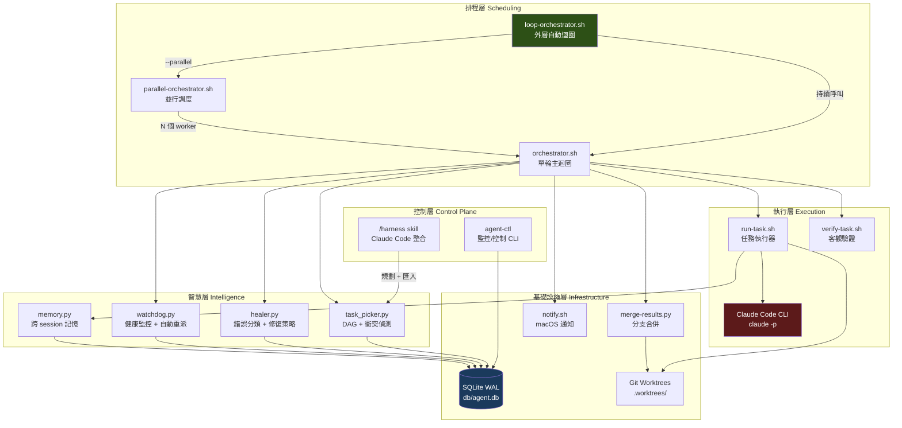

---

## 2. 核心迴圈流程

### 2.1 外層迴圈 — loop-orchestrator.sh

整個系統的**推薦入口**。持續執行 orchestrator 直到 DAG 完成。

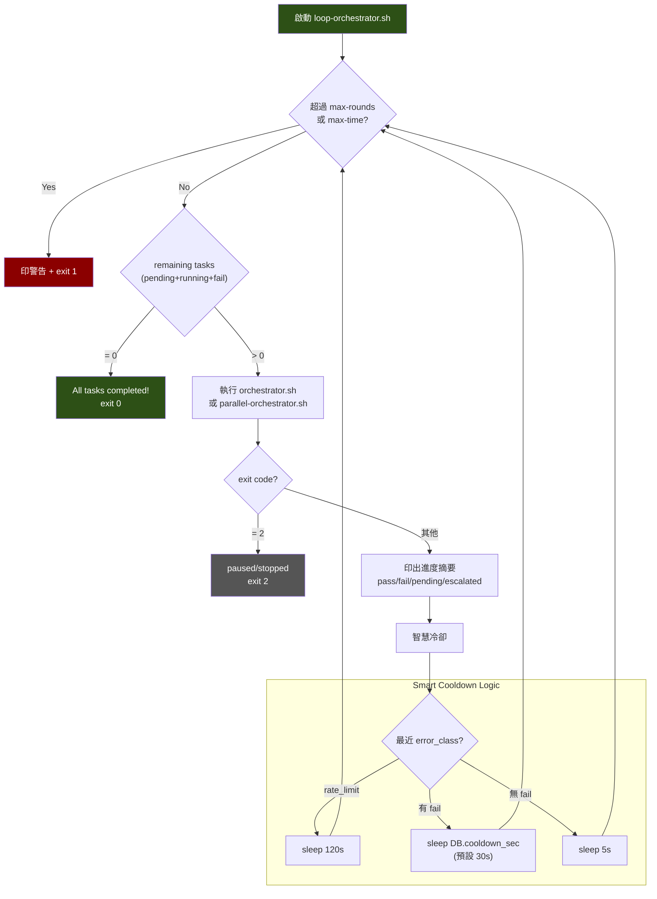

**安全限制（預設值）：**

| 參數 | 預設 | 說明 |
|------|------|------|
| `--max-rounds` | 500 | 防止無限迴圈 |
| `--max-time` | 86400 (24h) | 防止無限空轉 |

### 2.2 單輪迴圈 — orchestrator.sh

每輪處理一個任務的完整生命週期。

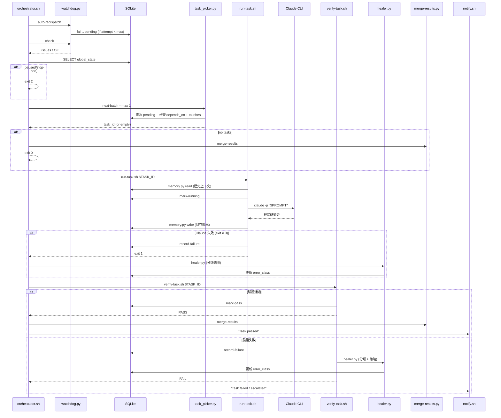

### 2.3 並行調度 — parallel-orchestrator.sh

同時派發多個不衝突的任務。

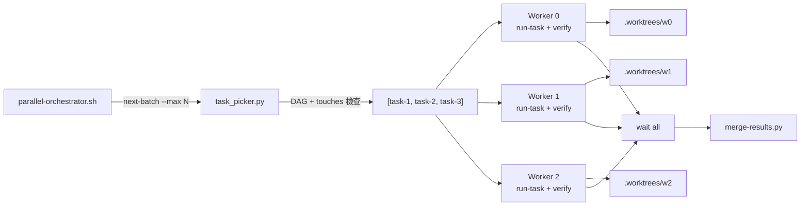

---

## 3. 自我修復迴圈

完整的 fail → classify → heal → retry → pass/escalate 流程：

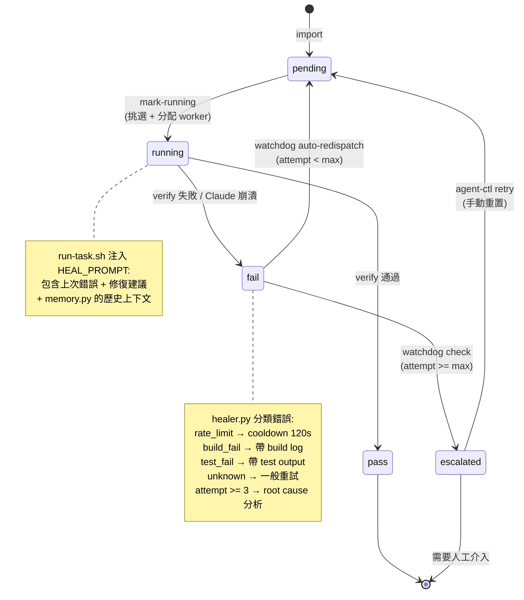

### 自癒資料流

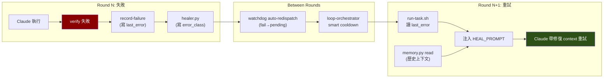

---

## 4. 資料模型

### 4.1 資料庫 Schema

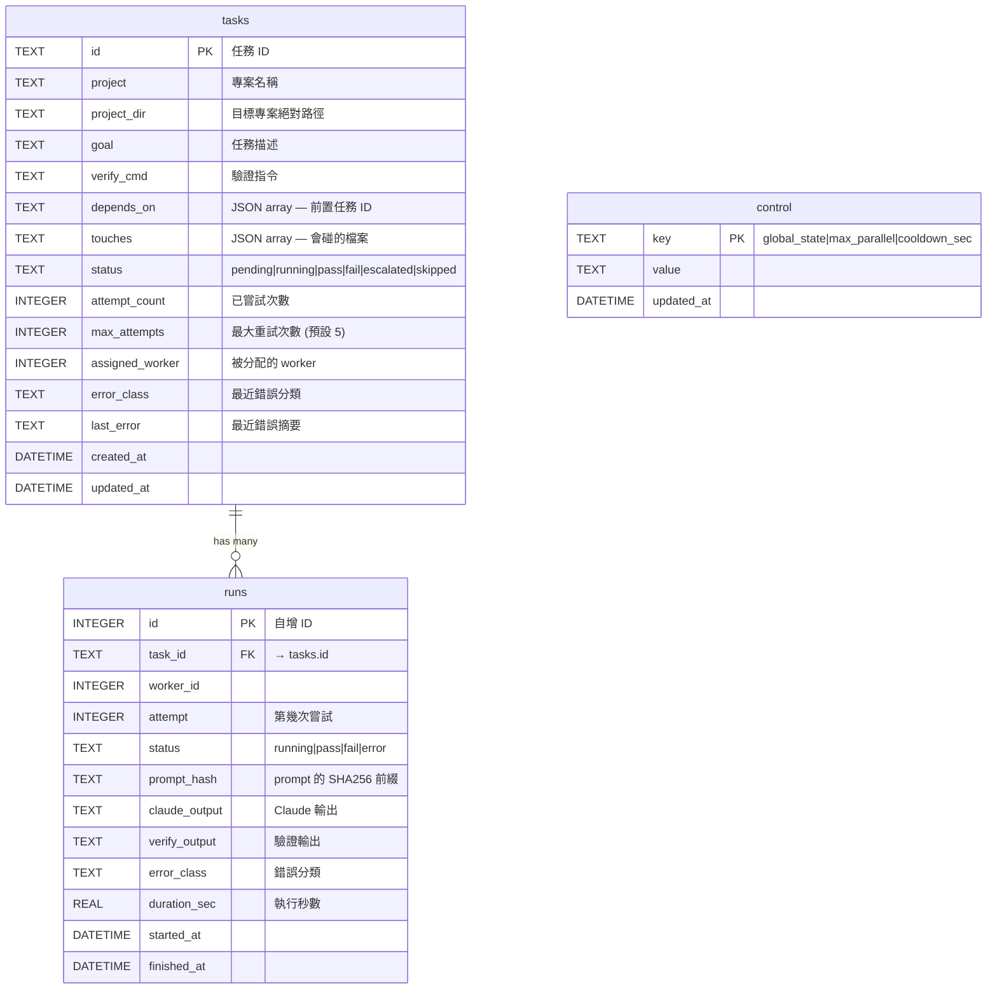

### 4.2 Control 表預設值

| key | 預設值 | 用途 |
|-----|--------|------|
| `global_state` | `running` | 系統狀態（running/paused/stopped） |
| `max_parallel` | `4` | 並行 worker 上限 |
| `cooldown_sec` | `30` | 一般失敗冷卻時間 |

### 4.3 任務狀態機

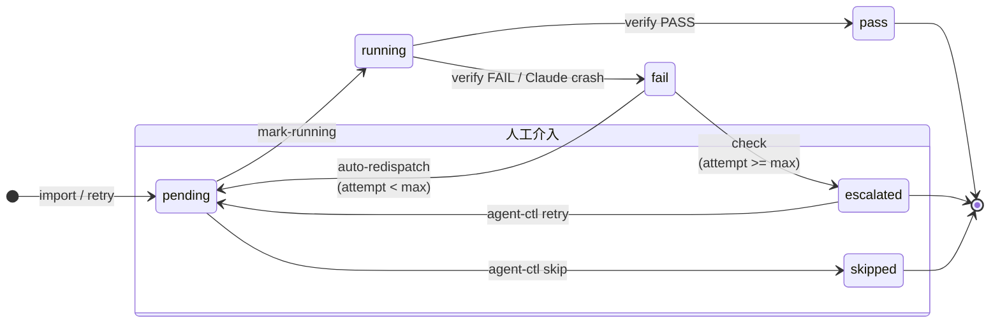

---

## 5. 模組詳細說明

### 5.1 loop-orchestrator.sh — 外層自動迴圈

**推薦的系統入口。** 持續執行 orchestrator 直到 DAG 完成或安全限制觸發。

```bash
bash loop-orchestrator.sh [--parallel] [--max-rounds N] [--max-time M]
```

**職責：**
- 查詢 remaining tasks（pending + running + fail）
- 呼叫 orchestrator.sh 或 parallel-orchestrator.sh
- 根據 error_class 決定 cooldown 時間
- 每輪印出進度摘要
- max-rounds / max-time 安全保險絲

**Exit codes：** 0=全部完成, 1=安全限制, 2=paused/stopped

### 5.2 orchestrator.sh — 單輪主迴圈

單輪處理一個任務的完整生命週期。

**流程：**
1. `watchdog.py auto-redispatch` — 重派可重試的失敗任務
2. `watchdog.py check` — 健康檢查 + escalation
3. 檢查 `control.global_state`
4. `task_picker.py next-batch --max 1` — 挑選下一個可執行任務
5. `run-task.sh` — 執行任務
6. **若 Claude 崩潰 → 呼叫 healer.py 分類錯誤**
7. `verify-task.sh` — 驗證結果
8. 處理結果（pass → merge, fail → record）

**Exit codes：** 0=正常, 1=錯誤, 2=paused/stopped

### 5.3 parallel-orchestrator.sh — 並行調度

一次派發多個不衝突的任務到不同 worker。

**流程：**
1. 健康檢查 + 控制訊號
2. `task_picker.py next-batch --max N` — 取得一批不衝突的任務
3. 為每個任務在背景啟動 `run-task.sh` + `verify-task.sh`
4. 等待所有 worker 完成
5. `merge-results.py` 合併通過的分支

### 5.4 run-task.sh — 任務執行器

在正確的工作目錄中執行 Claude CLI。

**關鍵機制：**
- 讀取 `memory.py` 歷史上下文
- 讀取 `last_error` 組合 HEAL_PROMPT（帶上次失敗資訊）
- 決定工作目錄：`project_dir` > worktree > harness dir
- 呼叫 `claude -p` 執行任務
- Claude 崩潰時呼叫 `record-failure`

### 5.5 verify-task.sh — 客觀驗證

在 `project_dir` 下執行 `verify_cmd`。

- 無 verify_cmd → 自動 pass
- exit 0 → mark-pass
- exit ≠ 0 → record-failure + 呼叫 healer.py

### 5.6 task_picker.py — DAG 管理

**CLI 子命令：**

| 命令 | 說明 |
|------|------|
| `import <dir>` | 匯入 JSON 任務定義 |
| `get <task_id>` | 取得任務 JSON |
| `get-verify <task_id>` | 取得驗證指令 |
| `mark-running <task_id> <worker>` | 標記為執行中 |
| `mark-pass <task_id>` | 標記為通過 |
| `record-failure <task_id> <text>` | 記錄失敗 |
| `next-batch --max N` | 取得下批可執行任務 |
| `escalate <task_id>` | 標記為 escalated |

**next-batch 選擇邏輯：**
1. `status = 'pending'`
2. 所有 `depends_on` 任務 status = 'pass'
3. `touches` 與 running 任務不衝突
4. 回傳不超過 max 個任務

### 5.7 healer.py — 錯誤分類 + 修復策略

讀取失敗輸出，分類錯誤，產生修復建議。

**錯誤分類：**

| error_class | 匹配模式 | cooldown |
|-------------|---------|----------|
| `rate_limit` | "429", "rate limit" | 120s |
| `merge_conflict` | "merge conflict" | 0s |
| `build_fail` | "build failed" | 0s |
| `test_fail` | "test failed" | 0s |
| `unknown` | 其他 | 0s |

**策略升級：**
- attempt >= 3 → 強制 root cause 分析（prompt 前綴）
- attempt >= max_attempts → `{"action": "escalate"}`

### 5.8 watchdog.py — 健康監控

**check 子命令：**
- 卡住的任務（running > 15 分鐘）
- 全域停滯（連續 10 次失敗無通過）
- 超過重試上限 → 自動標記 escalated
- 全部完成偵測

**auto-redispatch 子命令：**
- `status='fail' AND attempt_count < max_attempts` → `status='pending'`

### 5.9 memory.py — 跨 Session 記憶

讓 Claude 能回顧先前嘗試的結果。

- `read <task_id>` — 回傳最近 3 次執行的 Markdown 格式摘要
- `write <task_id>` — 記錄本次執行結果到 runs 表

### 5.10 merge-results.py — 分支合併

將通過驗證的 worker 分支合併回 main。

- 掃描 `.worktrees/w*`
- 確認對應任務 status = 'pass'
- `git merge --no-ff`
- 衝突 → 自動建立 resolve-conflict 任務

### 5.11 agent-ctl — 監控/控制 CLI

提供完整的系統監控和控制能力。

**子命令：** status, tasks, logs, pause, resume, stop, kill, skip, retry, plan

### 5.12 notify.sh — macOS 通知

透過 `osascript` 發送桌面通知。失敗不中斷流程。

### 5.13 setup-worktrees.sh — Git Worktree 初始化

為並行 worker 建立獨立的 git worktree 工作環境。

---

## 6. 模組依賴關係

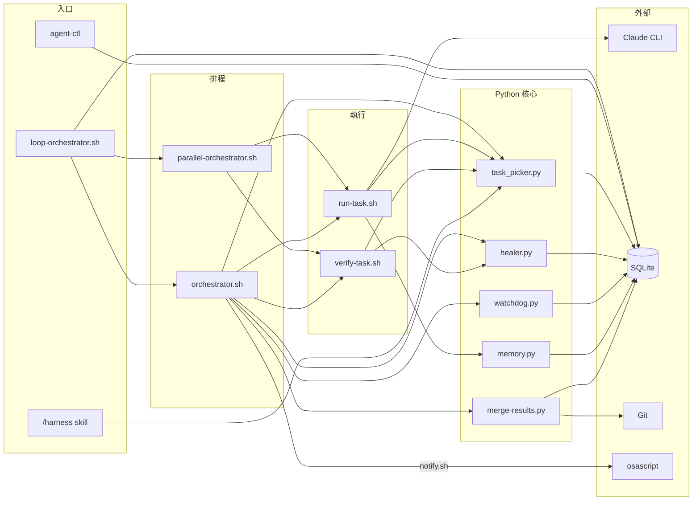

### 依賴矩陣

| 模組 | 依賴 | 被依賴 |
|------|------|--------|
| `loop-orchestrator.sh` | `orchestrator.sh`, `parallel-orchestrator.sh`, SQLite | 使用者入口 |
| `orchestrator.sh` | `task_picker.py`, `run-task.sh`, `verify-task.sh`, `healer.py`, `watchdog.py`, `merge-results.py`, `notify.sh` | `loop-orchestrator.sh`, `parallel-orchestrator.sh` |
| `parallel-orchestrator.sh` | `run-task.sh`, `verify-task.sh`, `watchdog.py`, `task_picker.py`, `merge-results.py` | `loop-orchestrator.sh` |
| `run-task.sh` | `task_picker.py`, `memory.py`, Claude CLI | `orchestrator.sh`, `parallel-orchestrator.sh` |
| `verify-task.sh` | `task_picker.py`, `healer.py` | `orchestrator.sh`, `parallel-orchestrator.sh` |
| `task_picker.py` | SQLite | 幾乎所有模組 |
| `healer.py` | SQLite | `orchestrator.sh`, `verify-task.sh` |
| `watchdog.py` | SQLite | `orchestrator.sh`, `parallel-orchestrator.sh` |
| `memory.py` | SQLite | `run-task.sh` |
| `merge-results.py` | SQLite, Git | `orchestrator.sh`, `parallel-orchestrator.sh` |
| `agent-ctl` | SQLite, `task_picker.py` | 使用者 |

---

## 7. SQLite 存取模式

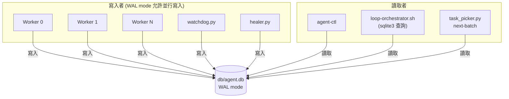

**WAL 模式優勢：**
- 讀寫不互相阻塞
- 多個 reader 可同時讀取
- 寫入是序列化的，但速度足夠（SQLite 可處理數千次/秒）

---

## 8. 跨專案執行架構

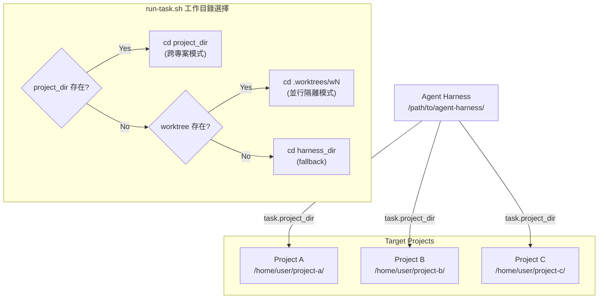

---

## 9. 安裝與部署

### 一鍵安裝

```bash
curl -sSL https://raw.githubusercontent.com/Muheng1992/agent-harness/main/install.sh | bash
```

**install.sh 做的事：**
1. 檢查 prerequisites（python3, sqlite3, jq, git, claude）
2. Clone 或 update repo 到 `~/.agent-harness/`
3. 初始化 SQLite 資料庫
4. 設定腳本執行權限
5. 建立 `agent-ctl` symlink 到 `~/.local/bin/`
6. 安裝 `/harness` Claude Code skill

### 目錄結構

```
~/.agent-harness/           # 安裝目錄
├── db/agent.db             # 所有任務狀態
├── tasks/{project}/        # 任務定義
├── logs/                   # 執行日誌
└── .worktrees/             # Git worktrees (並行用)

~/.local/bin/agent-ctl      # CLI symlink
~/.claude/commands/harness.md  # Claude Code skill
```

---

## 10. 設計決策與取捨

### 為什麼用 SQLite 而非 Redis/Postgres？

- 零依賴：macOS 內建 sqlite3
- WAL 模式足以應付 4-8 個並行 worker
- 單檔案，方便備份和傳輸
- 適合本機執行的 agent 系統（非分散式）

### 為什麼每輪都啟動新 Claude session？

- 避免 context window 壓縮導致的遺忘
- 每輪乾淨狀態，避免前次失敗的殘留影響
- 記憶外化到 SQLite，由 memory.py 在 prompt 中注入相關上下文
- Max 訂閱方案無 API 費用限制

### 為什麼 loop-orchestrator 而非 cron？

- cron 需要額外設定，且缺乏智慧冷卻
- loop-orchestrator 能根據 error_class 動態調整 cooldown
- 內建安全限制（max-rounds, max-time）
- 更好的進度追蹤和日誌輸出
- cron 仍可用，但不再是推薦方式

### verify_cmd 的安全考量

- verify_cmd 直接在 shell 中 `eval` 執行
- **前提假設**：任務 JSON 來自可信來源（你自己或 /harness skill）
- 不適合執行來自不可信使用者提交的任務

---

## 11. 多角色系統架構

### 11.1 角色系統架構圖

```
┌─────────────────────────────────────────────────────────────────┐
│                        run-task.sh                              │
│  ┌───────────┐    ┌───────────────┐    ┌──────────────────┐    │
│  │ 讀取 task │───→│ 載入 role 定義 │───→│ 組合最終 prompt  │    │
│  │ (task_id) │    │ (roles/*.md)  │    │ role + goal +    │    │
│  └───────────┘    └───────────────┘    │ memory + heal    │    │
│                          │              └────────┬─────────┘    │
│                          │                       │              │
│                   ┌──────▼──────┐         ┌──────▼──────┐      │
│                   │ 解析 YAML   │         │ claude -p   │      │
│                   │ frontmatter │         │ --allowedTools│     │
│                   │             │         │ $CLAUDE_TOOLS │     │
│                   │ name        │         └─────────────┘      │
│                   │ allowed_tools│                               │
│                   │ model       │                               │
│                   └─────────────┘                               │
└─────────────────────────────────────────────────────────────────┘

角色定義檔結構：
┌─────────────────────────────┐
│  roles/                     │
│  ├── planner.md        只讀 │  ← Read,Grep,Glob,Bash
│  ├── researcher.md     只讀 │  ← Read,Bash,WebSearch,WebFetch,Grep,Glob
│  ├── architect.md      只讀 │  ← Read,Grep,Glob,Bash
│  ├── implementer.md    讀寫 │  ← Edit,Write,Bash,Read,Grep,Glob
│  ├── tester.md         讀寫 │  ← Edit,Write,Bash,Read,Grep,Glob
│  ├── reviewer.md       只讀 │  ← Read,Grep,Glob,Bash
│  ├── debugger.md       讀寫 │  ← Edit,Write,Bash,Read,Grep,Glob
│  ├── security-auditor.md只讀│  ← Read,Grep,Glob,Bash
│  ├── documenter.md     讀寫 │  ← Write,Edit,Read,Grep,Glob,Bash
│  ├── integrator.md     讀寫 │  ← Edit,Write,Bash,Read,Grep,Glob
│  └── devops.md         讀寫 │  ← Edit,Write,Bash,Read,Grep,Glob
└─────────────────────────────┘

工具權限分級：
┌──────────────┬──────────────────────────────────────────┐
│ 分析/審查類   │ 只授予 Read, Grep, Glob, Bash            │
│ （不修改程式碼）│ planner, architect, reviewer,            │
│              │ security-auditor                          │
├──────────────┼──────────────────────────────────────────┤
│ 實作/修復類   │ 額外授予 Edit, Write                      │
│ （需修改程式碼）│ implementer, tester, debugger,           │
│              │ documenter, integrator, devops            │
├──────────────┼──────────────────────────────────────────┤
│ 研究類       │ 額外授予 WebSearch, WebFetch               │
│ （需上網查資料）│ researcher                               │
└──────────────┴──────────────────────────────────────────┘
```

### 11.2 角色載入流程

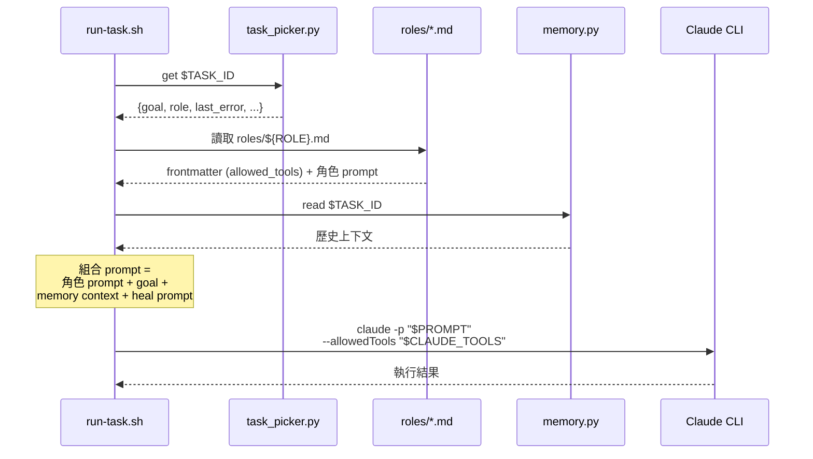

---

## 12. Pipeline 引擎資料流

### 12.1 Pipeline 生命週期

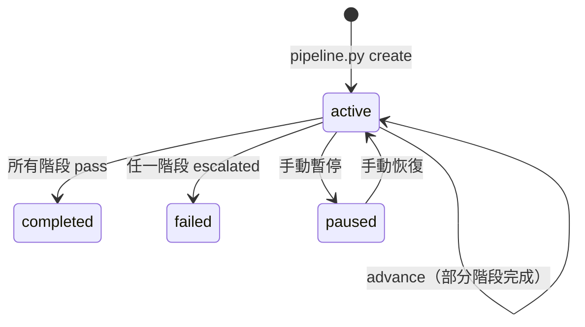

### 12.2 Pipeline 建立與執行資料流

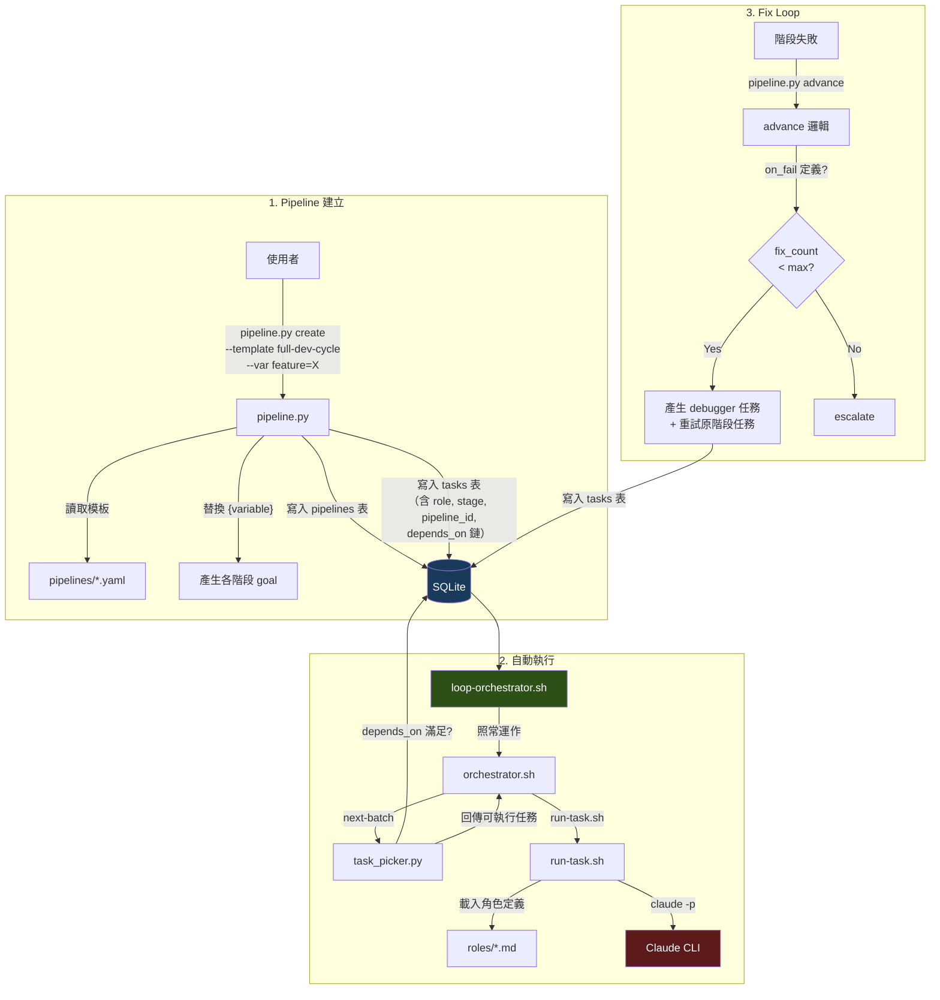

### 12.3 元件交互圖

```
┌─────────────────────────────────────────────────────────────────────┐
│                        使用者操作                                     │
│  pipeline.py create ──→ 建立 pipeline + tasks                        │
│  agent-ctl status    ──→ 查看執行進度                                  │
│  loop-orchestrator.sh ─→ 啟動自動執行                                  │
└──────────┬──────────────────────────────────────────────────────────┘
           │
           ▼
┌──────────────────────────────────────────────────────────────────────┐
│  task_picker.py                                                      │
│  ┌────────────────────────────────────────────────────────────────┐  │
│  │ next-batch: 查詢 status='pending' AND depends_on 全 pass       │  │
│  │            + touches 衝突檢查 + role 欄位保留                    │  │
│  └────────────────┬───────────────────────────────────────────────┘  │
└───────────────────┼──────────────────────────────────────────────────┘
                    │ 回傳 task_id（含 role 資訊）
                    ▼
┌──────────────────────────────────────────────────────────────────────┐
│  run-task.sh                                                         │
│  ┌──────────┐  ┌──────────────┐  ┌────────────┐  ┌──────────────┐  │
│  │ 讀取 task │→│ 讀取 role 定義│→│ 讀取 memory │→│ 組合 prompt   │  │
│  │ (DB)     │  │ (roles/*.md) │  │ (memory.py)│  │ + heal context│  │
│  └──────────┘  └──────────────┘  └────────────┘  └──────┬───────┘  │
│                                                          │          │
│                                              claude -p + --allowedTools│
└──────────────────────────────────────────────────────────────────────┘
                    │ 執行完成
                    ▼
┌──────────────────────────────────────────────────────────────────────┐
│  pipeline.py advance（由 orchestrator 在每輪呼叫）                     │
│  ┌──────────────────────────────────────────────────────────────┐    │
│  │ 檢查 pipeline 下所有 tasks 的 status                          │    │
│  │ ├─ 全部 pass → pipeline status = completed                   │    │
│  │ ├─ 有 escalated → pipeline status = failed                   │    │
│  │ └─ 有 fail + on_fail 定義 → 產生 debugger + retry 任務        │    │
│  └──────────────────────────────────────────────────────────────┘    │
└──────────────────────────────────────────────────────────────────────┘
```

---

## 13. 新增的資料庫欄位

### 13.1 tasks 表新增欄位

| 欄位 | 型別 | 預設值 | 說明 |
|------|------|--------|------|
| `role` | TEXT | `'implementer'` | 指派角色，對應 `roles/*.md` 的檔案名稱 |
| `stage` | TEXT | NULL | Pipeline 階段名稱（如 research、design、implement） |
| `pipeline_id` | TEXT | NULL | 所屬 pipeline 群組 ID，用於追蹤多階段流程 |
| `spawned_by` | TEXT | NULL | 觸發此任務的上游任務 ID（fix loop 產生的任務會指向失敗的原任務） |

### 13.2 新增 pipelines 表

```sql
CREATE TABLE IF NOT EXISTS pipelines (
  id         TEXT PRIMARY KEY,           -- pipe-{timestamp}-{random}
  name       TEXT NOT NULL,              -- 模板顯示名稱
  project    TEXT NOT NULL,              -- 所屬專案
  template   TEXT,                       -- 使用的模板名稱（如 full-dev-cycle）
  config     TEXT DEFAULT '{}',          -- JSON 配置（變數、verify_cmd、fix_loops）
  status     TEXT DEFAULT 'active'       -- active|completed|failed|paused
             CHECK(status IN ('active','completed','failed','paused')),
  created_at DATETIME DEFAULT CURRENT_TIMESTAMP,
  updated_at DATETIME DEFAULT CURRENT_TIMESTAMP
);
```

### 13.3 新增索引

```sql
CREATE INDEX IF NOT EXISTS idx_tasks_role ON tasks(role);
CREATE INDEX IF NOT EXISTS idx_tasks_pipeline_id ON tasks(pipeline_id);
CREATE INDEX IF NOT EXISTS idx_pipelines_status ON pipelines(status);
```

---

*文件版本: 3.0 | 建立日期: 2026-04-01 | Agent Harness 架構設計（含多角色 + Pipeline 系統）*
